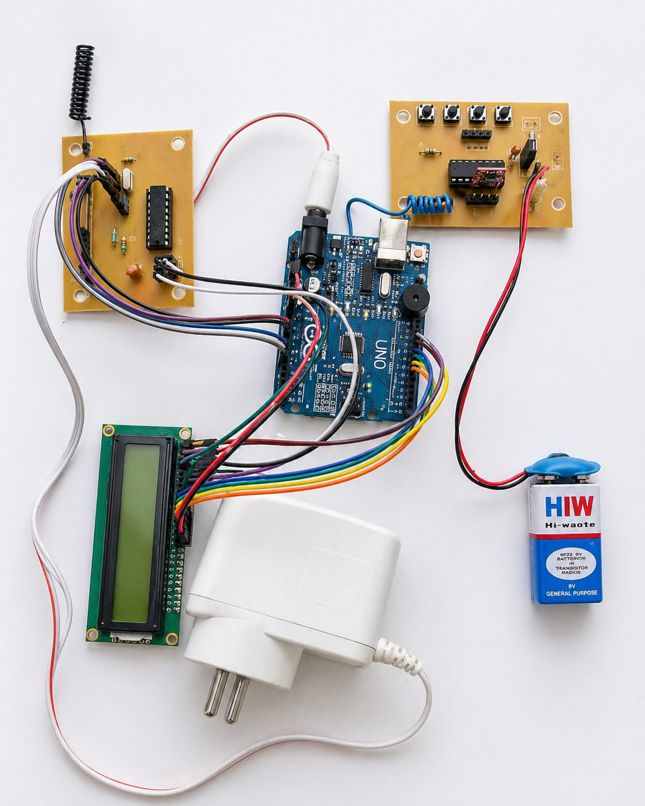
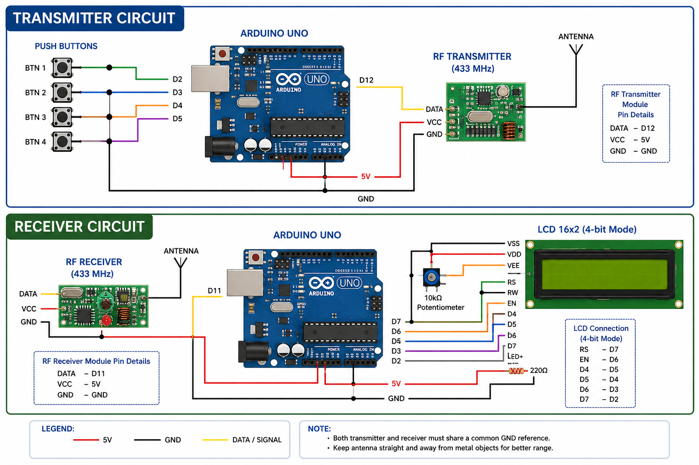

# Secure RF Communication System using Encryption (Arduino)

RF-based wireless encryption and decryption system for secure data transmission using Arduino UNO and RF modules.

---

## Project Overview
This project implements a secure RF communication system where data is encrypted before transmission and decrypted at the receiver side. It ensures that transmitted information cannot be easily intercepted or understood by unauthorized users.

---

##  Hardware Setup
.
---

##  Components Used
- Arduino UNO
- RF Transmitter & Receiver (433 MHz)
- LCD Display (16x2)
- Encoder/Decoder IC
- Push Buttons
- 9V Battery / Power Supply
- Connecting Wires

---

##  Working Principle
1. User inputs data using buttons
2. Data is encrypted using XOR technique
3. Encrypted data is transmitted via RF module
4. Receiver captures the signal
5. Data is decrypted using same key
6. Output is displayed on LCD

---

##  Code Files
- `Transmitter.ino` → Handles encryption & transmission
- `Receiver.ino` → Handles reception & decryption

---

##  Applications
- Military secure communication
- Wireless data transmission
- Remote control systems
- IoT security systems

---

## Future Improvements
- Implement AES encryption (advanced security)
- Increase communication range
- Add mobile app integration
- Real-time monitoring system

---

## Circuit Diagram

---

## Author
**Paramesh Panjala**

---
